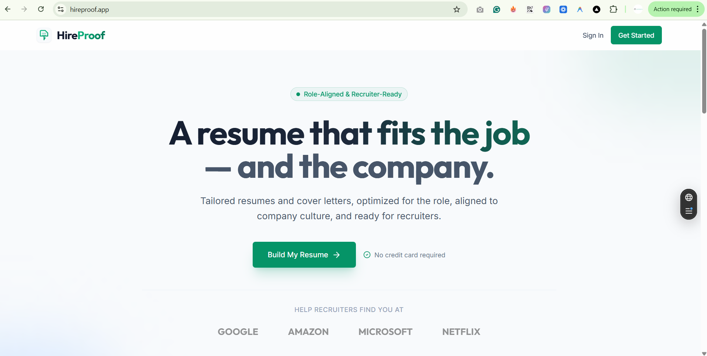
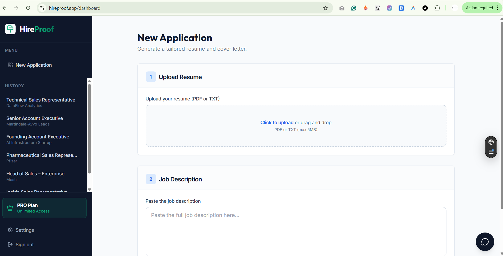

# HireProof (hireproof.app) - AI-Powered Resume Tailor 🚀

> **A Next.js application that uses LLMs to "beat the bots" by tailoring resumes to specific job descriptions.**

# 🔗 **[VISIT LIVE APP: HIREPROOF.APP](https://hireproof.app)**

---

## 🎯 Represents What?
This project demonstrates my ability to build **production-grade AI SaaS applications**. It handles real payments, secure authentication, and complex LLM orchestration.

**🔒 Source Code:** The source code is private as this is a commercial product. However, this repository validates the architecture and features built.

---

## ✨ Key Features

### 1. 🤖 Intelligent Resume Tailoring
*   **Vector Analysis:** Uses LLMS to analyze Job Descriptions vs. Resumes.
*   **Gap Analysis:** Identifies missing keywords and suggests "Honest" improvements (no hallucinations).
*   **PDF Parsing:** robust ingestion of user documents.

### 2. 🛡️ Production Security
*   **Content Safety:** Implemented "System Prompts" that prevent the AI from lying.
*   **Rate Limiting:** Double-layered protection (Cloudflare + Upstash Redis) to prevent API abuse.
*   **Input Validation:** Strict Zod schemas and character limits to prevent DoS attacks.

### 3. 💳 Subscription Payments
*   **Stripe Integration:** Full checkout flow with Webhook reconciliation.
*   **One-Time vs Subscriptions:** Handles consumable credits (LightPack) and Lifetime access.
*   **Atomic Logic:** Ensures usage limits (e.g., 50 generations/month) are strictly enforced in the database.

---

## 🛠️ The Tech Stack

*   **Frontend:** Next.js 14+ (App Router), TailwindCSS, Shadcn/UI.
*   **Backend:** Next.js Server Actions, Supabase (Postgres).
*   **Auth:** Supabase Auth (Google & LinkedIn OAuth).
*   **AI:** OpenAI GPT-4o-mini (Orchestrated via custom "Judge" pipeline).
*   **Database:** PostgreSQL with Row Level Security (RLS).
*   **Testing:** Playwright (E2E) & Vitest (Unit).

---

## 🏗️ Architecture Highlights

### The "Judge" Pattern
Instead of blindly trusting the AI, I implemented a "Judge" step:
1.  **Generator:** Drafts the resume.
2.  **Judge (AI):** Reviews the draft against the original to flag "Hallucinations" (skills the user didn't have).
3.  **Client:** Only shows the result if it passes the "Integrity Check".

---

## 📸 Gallery

### Landing Page

### The Dashboard

### The Builder

---

## 👤 Author

Built by **MJ**.
If you'd like to discuss the engineering challenges behind this project, feel free to reach out!